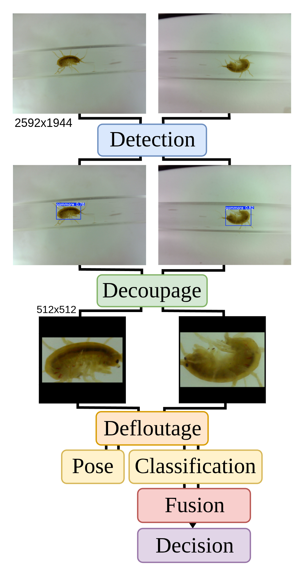
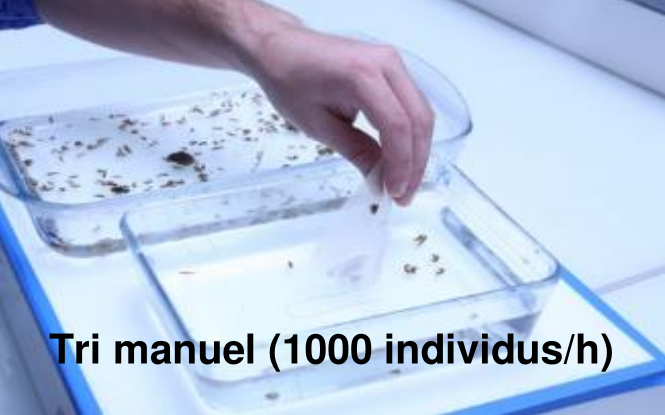
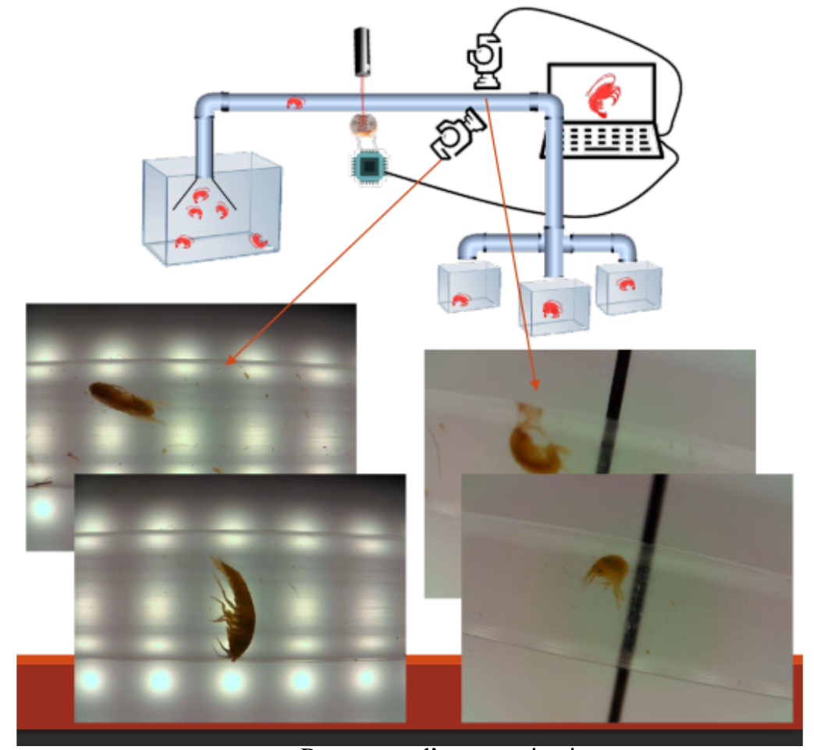
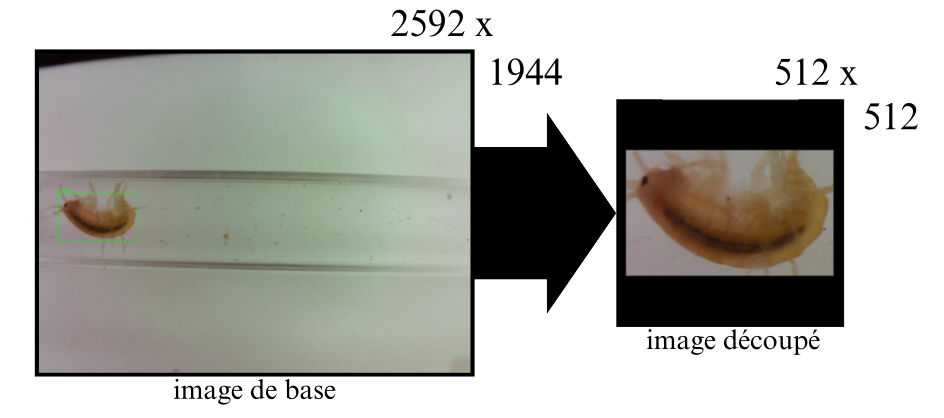
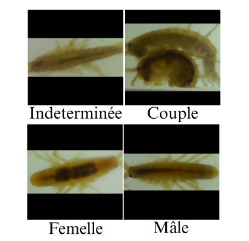

# Biomae Gammarus Analysis

Automated *Gammarus* sorting from dual orthogonal camera views for water-quality bio-surveillance at [Biomae](https://www.biomae.fr/).



## Problem

- **Manual sorting** under a microscope: ~**1,000 specimens/h**, tedious, error-prone.
- **Hard imaging conditions**: low light, motion blur, tiny subjects in clear tubes.
- **Dual-view capture**: each specimen has two synchronized frames (`img_A_*` / `img_B_*`).



## Solution

Target pipeline (see diagram above):

1. **YOLOv11n** detection — 1024 px input, single-class mode.
2. **512×512** pad/crop — IoU grouping (threshold 0.25) merges overlapping boxes into couple crops.
3. **MobileNetV3-large** — four classes: `male`, `femelle`, `couple`, `indeterminee`.
4. **Conditional NAFNet** deblurring — only on `indeterminee` crops *(explored, not in this repo)*.
5. **Pose estimation + MLP fusion** across views A/B *(pose not shipped; MLP is legacy only)*.

**What runs today:** steps 1–3, per view, independently — via [`GammarusPipeline`](src/biomae/pipeline.py).







## Results

MobileNetV3 v4 on held-out validation set:

| Class | Precision | Recall | F1 |
|-------|-----------|--------|-----|
| couple | 1.00 | 1.00 | 1.00 |
| femelle | 1.00 | 0.85 | 0.92 |
| indeterminee | 0.92 | 0.92 | 0.92 |
| male | 0.81 | 0.91 | 0.86 |
| **Macro avg** | **0.93** | **0.92** | **0.92** |

Inference entry point: `GammarusPipeline.process_dual_view()` in [`src/biomae/pipeline.py`](src/biomae/pipeline.py).

## Engineering insight — conditional deblurring

Motion blur under low light is common. Two strategies tested:

- **Global NAFNet** on every crop → macro F1 dropped from **~0.92** to **~0.80** (domain shift — smoothing artifacts the classifier never saw in training).
- **Conditional NAFNet** triggered only when the classifier predicts `indeterminee` → macro F1 back to **0.92**.

Treat `indeterminee` as a rejection class. Deblur the uncertain cases; leave clean crops untouched.

## Tech stack

- **YOLOv11n** — [Ultralytics](https://github.com/ultralytics/ultralytics)
- **MobileNetV3-large** — PyTorch / torchvision
- **NAFNet** — explored, not shipped
- **DeepLabCut / YOLO-Pose** — explored, not shipped
- **PyTorch MLP fusion** — legacy ([`src/biomae/fusion.py`](src/biomae/fusion.py))
- OpenCV, Pillow, scikit-learn

## Setup & run

**Requirements:** Python 3.10+, CUDA GPU recommended.

```bash
pip install -e . && pip install -r requirements.txt
```

Place weights in `checkpoints/` — see [`checkpoints/README.md`](checkpoints/README.md) (`yolov11n_best.pt`, `mobilenet_v3_v4.pth`, `model_meta.json`).

```bash
jupyter lab notebooks/04_inference_pipeline.ipynb
```

```python
from biomae.pipeline import GammarusPipeline
from biomae.paths import checkpoint_path, data_path

pipeline = GammarusPipeline(
    yolo_weights=checkpoint_path("yolov11n_best.pt"),
    clf_weights=checkpoint_path("mobilenet_v3_v4.pth"),
    clf_meta=checkpoint_path("model_meta.json"),
)
results = pipeline.process_dual_view(
    data_path("01_raw/mfi_dataset/val/images/img_A_00049.png"),
    data_path("01_raw/mfi_dataset/val/images/img_B_00049.png"),
)
```

**Training:** `notebooks/01_train_yolo.ipynb` → `02_train_mobilenet.ipynb` → `03_train_mlp_fusion.ipynb` (legacy).

## Limitations

- **No cross-view fusion** in current inference — views A and B are processed independently.
- **NAFNet and pose estimation** are not implemented in this repository.
- **Checkpoints and lab dataset** are not bundled — see [`data/README.md`](data/README.md).
- **Couple class**: perfect val metrics, but very few val samples — high variance risk.
- **Male** (precision 0.81) and **femelle** (recall 0.85) remain the harder classes.
- **`configs/*.yaml`** are reference configs — not loaded by the Python pipeline yet.

## Further reading

- [Biomae laboratory presentation (YouTube)](https://youtu.be/pltMficnO6Y)

## Credits

Arthur Mourgue — INSA Lyon · [Biomae](https://www.biomae.fr/) — dataset & sponsor

MIT — see [`LICENSE`](LICENSE).
