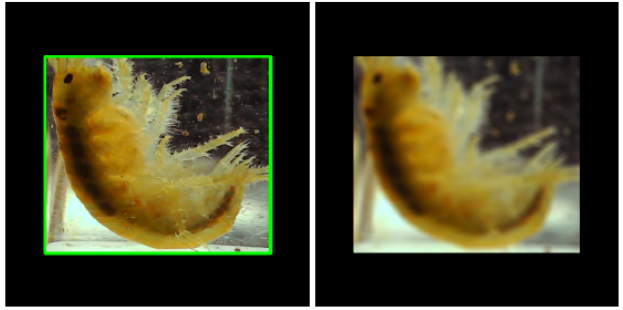

# Analyse de Gammarus Biomae

<table width="100%">
  <tr>
    <td width="60%" valign="middle" style="padding-right: 15px;">
      <b>Tri automatisé de Gammarus pour la biosurveillance de la qualité de l'eau chez <a href="https://www.biomae.fr/">Biomae</a></b>
      <br><br>
      L'entreprise Biomae utilise des gammares soit de petites crevettes d'eau douce pour évaluer le niveau de pollution de l'eau. Pour que ces tests fonctionnent il faut séparer les individus selon leur sexe ou s'ils sont en couple.
      <br><br>
    </td>
    <td width="40%" align="center" valign="middle">
      
    </td>
  </tr>
</table>

## Le Problème

<table width="100%">
  <tr>
    <td width="60%" valign="middle" style="padding-right: 15px;">
      Aujourd hui le tri se fait à la main sous un microscope. C'est un travail long fatigant pour les yeux et sujet aux erreurs. Un humain ne peut trier qu'environ 1 000 spécimens par heure.<br><br>
      L'automatisation est compliquée à cause des conditions d'observation car pour maintenir les gammares en vie et ne pas les stresser la lumière doit rester très faible. <br><br>
      Les gammares bougent vite dans leurs tubes transparents ce qui crée beaucoup de flou de mouvement sur les vidéos.
    </td>
    <td width="40%" align="center" valign="middle">
      
    </td>
  </tr>
</table>

## La Solution

<table width="100%">
  <tr>
    <td width="60%" valign="middle" style="padding-right: 15px;">
      Notre pipeline automatisé gère ces conditions complexes et accélère considérablement le processus pour remplacer intégralement le tri manuel des opérateurs.
    </td>
    <td width="40%" align="center" valign="middle">
      
    </td>
  </tr>
  <tr>
    <td width="60%" valign="middle" style="padding-right: 15px;">
      <b>1. Détection et Recadrage</b><br><br>
      L'ordinateur commence par regarder l'image globale et repère le gammare. Il découpe ensuite cette petite zone pour enlever tout le décor inutile du tube. Cela permet au système de se concentrer uniquement sur le gammares.
    </td>
    <td width="40%" align="center" valign="middle">
      
    </td>
  </tr>
  <tr>
    <td width="60%" valign="middle" style="padding-right: 15px;">
      <b>2. Le Défloutage</b><br><br>
      Nous avons créé un outil capable de rendre les images floues plus nettes. 
      Cependant nous avons remarqué que corriger toutes les images dégradait les résultats. Notre astuce est donc de ne déflouter que les images où l'ordinateur a un vrai doute.
    </td>
    <td width="40%" align="center" valign="middle">
      
    </td>
  </tr>
  <tr>
    <td width="60%" valign="middle" style="padding-right: 15px;">
      <b>3. Classification et Décision</b><br><br>
      Une fois l'image propre le modèle analyse la forme de la crevette et la classe instantanément en quatre catégories mâle femelle couple ou indéterminé.<br><br>
    </td>
    <td width="40%" align="center" valign="middle">
      
    </td>
  </tr>
</table>

## Résultats

Notre système obtient de bon résultats avec une précision moyenne de 92 % avec le score F1. Il reconnaît parfaitement les couples et est très performant pour identifier les cas ambigus et les femelles. 

| Classe | Précision | Rappel | F1 Réussite globale |
|-------|-----------|--------|-----|
| couple | 1.00 | 1.00 | 1.00 |
| femelle | 1.00 | 0.85 | 0.92 |
| indeterminee | 0.92 | 0.92 | 0.92 |
| male | 0.81 | 0.91 | 0.86 |

## Technologies utilisées

* **Détection :** YOLOv11n 
* **Classification :** MobileNetV3 
* **Défloutage :** NAFNet
* **Mesure :** DeepLabCut 
* **Outils divers :** OpenCV Pillow PyTorch

## Installation et Exécution

Installez les prérequis Python 3.10 et une carte graphique avec CUDA sont recommandés 

```bash
pip install -e . && pip install -r requirements.txt

```

Lancez le programme en Python pour analyser une image

```python
from biomae.pipeline import GammarusPipeline
from biomae.paths import checkpoint_path, data_path

pipeline = GammarusPipeline(
    yolo_weights=checkpoint_path("yolov11n_best.pt"),
    clf_weights=checkpoint_path("mobilenet_v3_v4.pth"),
    clf_meta=checkpoint_path("model_meta.json")
)

results = pipeline.process_image(data_path("dataset/images/image_00049.png"))

```

## Limites actuelles

* Les mâles et les femelles se ressemblent beaucoup ce qui reste la partie la plus difficile pour la machine.
* La classe couple a un score parfait de 100% mais ce chiffre est à prendre avec des pincettes car nous avions très peu d exemples de couples pour faire le test.
* Il faut encore intégrer ce programme informatique directement dans la vraie machine de tri physique.
